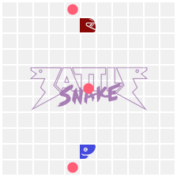

# Battle Snake

## Purpose
In Winter 2023, the Carleton Computer Science Society (CCSS) hosted a Battlesnake tournament where teams of 4 had to code their own Battlesnake to compete in a Battlesnake ladder tournament. We utitilzed Visual Studio Code Liveshare, Battlesnake APIs, flask API, and various python coding frameworks to become victorious in the tournament.

